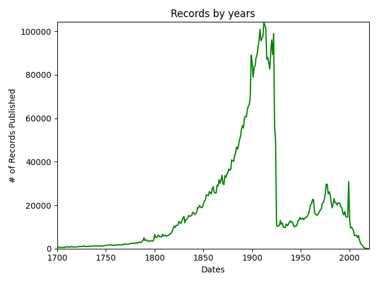
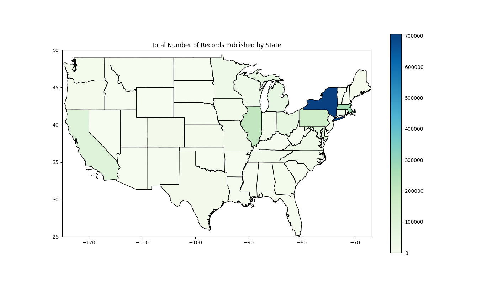
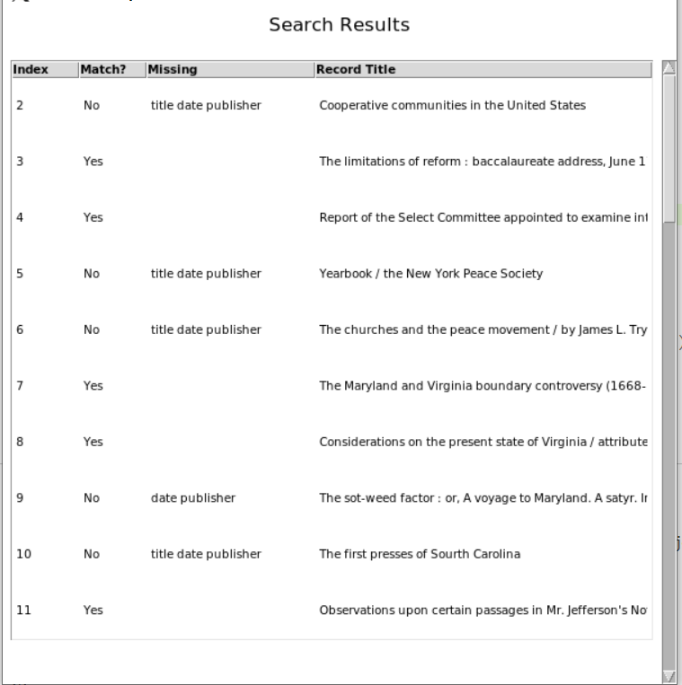

# :books: Digital Library Search Tool :books:

# Background

 

The project uses the [HathiTrust Digital Library](https://www.hathitrust.org/) as the data source. The library contains a total of 17 million published records, however, the program uses the 6 million records are publicly available. The HathiTrust Libary was founded in 2008 for non-profit academic purposes. It allows access to scholarly records for research and non-corporate interests. The library hold many public records from the UC system and other colleges.

I was introduced to HathiTrust through my part-time job working at a library. One of my tasks was to match the records of the our library to HathiTrust. The process included an excel sheet containing all queries, such as Title, Author, Publisher, Date, etc. My job was to go through each row in the excel sheet and determine whether or not the record is in HathiTrust based on the exact matching of the fields. To make this process more efficient, I decided to write a program that would help me query the records given the HathiTrust dataset.

# Application

1. [Parsing](#parsing)
2. [Search](#search)
3. [Data Visualization](#visual)
4. Application Interface
5. How to Install

I implemented the functionalities using Python with libaries such as pandas, numpy and matplotlib. 

            
            

# Parsing 

The inital data cleaning and parsing of the dataset was done using pandas dataframe and functions. The dataset downloaded from HathiTrust contained many unnecessary fields like the isbn #, oclc #, or collection code. Therefore I only extracted fields that I needed and ensured that the field exists within the record. After extracting all the columns as strings, I create a pandas dataframe for the new dataset and saved it into a pickle file with the function in parsed_topickle.py. 

After I created the complete data frame, I grouped the table by the author's last name. Since I wanted to seperate the data into chuck for faster reading, I decided to split by the author's name. The group by functions are done in gen_authorfiles.py. The chunking of data allows the process of reading dataframes faster. Each grouped dataframe is saved in a pickle file in the authors folder.

# Search Function

Excel Matching

Since each data is grouped by the author's last name, I used the author to search for a record. After the author dataframe is loaded into a dataframe, the given title keyword is queried. The first few words of the title are parsed from each row and another dataframe is returned containing the records that match with the title. 

After the title, I check if the publisher and date matches with the excel row. I used fuzzymatching to determine if the publisher and date matched with the previous results. If they match, I set the value to "True" in the "Matching" column of the result dataframe.

Keyword Search

The keyword search requires inputting the author's name. After the author's name is inputted, the title can be searched for through the pandas contains and apply methods to the dataframe. The result is a dataframe that contains all the records that match the author and title.

# Data Visualization

I wanted to explore how the variety of records at the HathiTrust library so I decided to visualize the dataset. There are two visualizations: a publication date graph and a publication location graph. 

 
The publication date graph explores the number of records published in a particular year.

 
The location graph outlines the publication places of all the records. The graph uses geopandas to map out all the geolocations of the cities that the records were published in.

# Interface

# Installation

